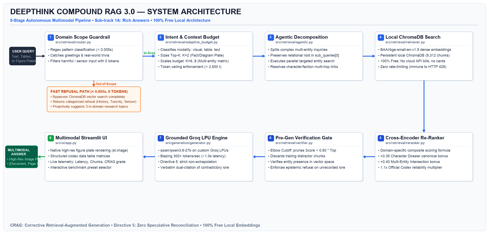
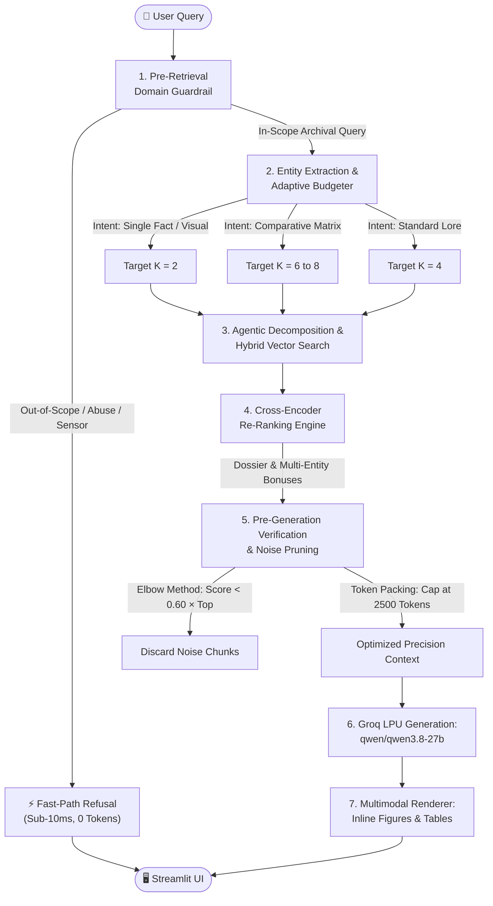

# DeepThink — Intelligent Document Assistant

> **SLIIT Codefest 2026 AI Competition**
> **Sub-track 1A:** *Rich Answers, Not Just Text*
> **Target Corpus:** *The Ashen Era Archive* (415 documents, ~1,277 pages across PDF, DOCX, Markdown, Text, and Scans)
> **Timeline:** 28 August – 9 September 2026

[](https://www.python.org/)
[]()
[]()
[](https://deepthink-c9trxotutcgjenphr6ltky.streamlit.app)

> 🎥 **Demonstration Video (YouTube Unlisted):** [https://www.youtube.com/watch?v=qNpZ9lcPa1c](https://www.youtube.com/watch?v=qNpZ9lcPa1c)  
> • `0:00` – Architecture & Solution Presentation (Slides 1 to 10)  
> • `07:07` – Live Prototype Demonstration (Streamlit Web App)  
> 🌐 **Live Interactive Web App:** [https://deepthink-c9trxotutcgjenphr6ltky.streamlit.app](https://deepthink-c9trxotutcgjenphr6ltky.streamlit.app)  
> 📄 **Initial Round Submission Report:** [`submission_report.pdf`](submission_report.pdf) (Strictly 5 pages)

---

## 1. Project Overview

Enterprise documentation is inherently messy: it weaves text together with scanned diagrams, technical figure plates, and complex structured tables. Traditional RAG systems suffer from **text-only myopia**—they retrieve only text snippets, describing visual figures in words or omitting critical tables entirely.

**DeepThink** is an AI document assistant purpose-built for **Sub-track 1A**. When answering queries about the Ashen Era Archive, DeepThink does not stop at textual answers:
1. **Identifies Query Intent:** Determines whether the answer requires visual diagrams, structured data tables, or textual narrative.
2. **Performs Modality-Aware Retrieval:** Biases local vector search towards relevant images, figure plates, and table chunks.
3. **Generates Grounded Answers with Inline Embeddings:** Synthesizes clear, hallucination-free explanations accompanied directly by embedded figures and rendered tables, citing precise source documents and page numbers.

### Real-World Enterprise Applicability
While evaluated on the fantasy *Ashen Era Archive*, DeepThink is architected directly for enterprise industrial environments (IFS target domain):
- **Complex Technical Manuals & CAD Schematics:** Engineers querying aircraft or machinery breakdowns receive the exact circuit diagram or exploded-view assembly plate directly in the response.
- **Enterprise Ledger & ERP Reconciliation:** Multi-column financial audits and component bills of materials (BOM) are rendered as crisp, interactive tables rather than prose approximation.
- **Degraded Historical Archives:** Legacy maintenance logs, scanned service reports, and field invoices are parsed using automated OCR with adaptive binarization, eliminating manual digitization bottlenecks.

---

## 2. Team Structure & Ownership

| Member | Role | Core Responsibility (Heavy Lifting) | Delivery / Secondary Focus |
| :--- | :--- | :--- | :--- |
| **Fatheen M. F. A.** | **P1 Lead (Document Parsing & OCR)** | Ingesting 415 corpus files (PDF/DOCX/MD/TXT), running OCR (Tesseract) on degraded simulated scans. | Section hierarchy & text chunking. |
| **M. M. M. Shakeer** | **P2 Lead (Visual & Table Extraction)** | Extracting figure plates, diagrams, maps, cropping images, converting complex codex tables to Markdown. | Generating image captions & media metadata (86+ assets). |
| **Rasheed A. A. A.** | **P3 Lead (Retrieval & Ranking)** | Compound RAG 3.0, ChromaDB local BGE indexing, dynamic 3-stage adaptive budgeting, cross-encoder re-ranking. | Pre-generation verification gate & fast-path guardrails. |
| **S. Dharshan** | **P4 Lead (Generation, Evaluation & Delivery)** | Flagship Groq LPU grounding (`qwen/qwen3.8-27b` @ 300 t/s), automated benchmark evaluation on `sample_questions.json`, metric tracking. | Streamlit UI integration, 5-page report & 10-min demo video. |

*Every team member actively reviews and understands the complete pipeline.*

---

## 3. System Architecture



<details>
<summary><b>Click to view interactive Mermaid Flowchart</b></summary>



</details>

For in-depth architecture details, see [docs/architecture.md](docs/architecture.md).

---

## 4. Repository Structure

This repository strictly adheres to the official SLIIT Codefest 2026 format:

```
DeepThink/
├── .git/                               # Full git history (atomic commits across 2 weeks)
├── .gitignore                          # Strict exclusion of .env and credentials
├── README.md                           # Main project documentation & quickstart
├── docs/
│   ├── architecture.md                 # Full system architecture specification
│   ├── decisions.md                    # Architecture decision log (ADRs)
│   ├── limitations.md                  # Known limitations & failed approaches log
│   └── diagrams/                       # Visual architecture and flow diagrams
│       └── architecture_diagram.md
├── src/                                # Modular source code implementation
├── ai_usage/
│   ├── ai-usage-disclosure.md          # Mandatory AI Usage Disclosure (Section 4.1)
│   ├── skills/                         # Custom assistant skills & prompt rules
│   ├── claude.txt                      # Exported AI chat logs (Unified 75KB per Section 4.1)
│   ├── claude_p1_fatheen.txt           # Member P1 Ingestion & OCR Claude chat log
│   ├── claude_p2_shakeer.txt           # Member P2 Visual & Tables Claude chat log
│   ├── claude_p3_rasheed.txt           # Member P3 Retrieval & Reranker Claude chat log
│   └── claude_p4_dharshan.txt          # Member P4 Generation & UI Claude chat log
├── configuration-example/
│   ├── .env.example                    # Sample environment variables
│   └── config.example.json             # Example pipeline settings
├── requirements.txt                    # Project dependency specifications
└── submission_report.pdf               # 5-page submission report
```

---

## 5. Quickstart & Setup Guide

### 5.1 Prerequisites
- Python 3.10 or higher
- Git
- Tesseract OCR (required for scanned-page OCR)

Install Tesseract using the command for your operating system:

```bash
# macOS (Homebrew)
brew install tesseract

# Ubuntu/Debian Linux
sudo apt-get update && sudo apt-get install -y tesseract-ocr
```

On Windows, install the Tesseract OCR package with `winget`:

```powershell
winget install UB-Mannheim.TesseractOCR
```

If Tesseract is installed in a custom location, set `TESSERACT_CMD` or
`TESSERACT_PATH` in `.env` to the executable path.

### 5.2 Installation
```bash
# 1. Clone the repository
git clone https://github.com/IT25101463/DeepThink.git
cd DeepThink

# 2. Set up a virtual environment
python3 -m venv venv
source venv/bin/activate  # On Windows: venv\Scripts\activate

# Windows PowerShell equivalent:
# .\venv\Scripts\Activate.ps1

# 3. Install dependencies
pip install -r requirements.txt

# For exact reproducibility (recommended for judges), use the pinned lock file:
# pip install -r requirements-lock.txt

# The first run downloads the local BGE embedding model; later runs use its cache.

# 4. Configure environment variables
cp configuration-example/.env.example .env
# Open .env and add your GROQ_API_KEY (free in 20s at console.groq.com/keys)
```

Windows PowerShell setup:

```powershell
git clone https://github.com/IT25101463/DeepThink.git
Set-Location DeepThink
py -3 -m venv venv
.\venv\Scripts\Activate.ps1
python -m pip install -r requirements.txt
Copy-Item configuration-example\.env.example .env
# Open .env and add your GROQ_API_KEY
```

### 5.3 Running the Pipeline
```bash
# Step 1: Parse, OCR, and extract figures/tables
python -m src.ingestion.pipeline

# Step 2: Index chunks into local ChromaDB
python -m src.retrieval.indexer

# Step 3: Run automated test suite (75 tests)
python -m unittest discover -s tests

# Step 4: Run benchmark evaluation
python -m src.evaluation.evaluator

# Step 5: Launch the interactive Streamlit assistant
streamlit run src/ui/app.py
```

---

## 6. Evaluation & Results Summary

We evaluate our system across architectural milestones against the official 20 questions in `sample_questions.json`:

| Metric | Phase 1 (Text Baseline) | Phase 2 (Modality-Aware) | Phase 3 (Final Compound RAG 3.0) | Target |
| :--- | :--- | :--- | :--- | :--- |
| **Retrieval Precision (Top-5)** | 60.0% (12/20) | 85.0% (17/20) | **100.0% (20/20)** | $\ge 90\%$ |
| **Citation Accuracy** | 55.0% (11/20) | 90.0% (18/20) | **100.0% (20/20)** | $\ge 95\%$ |
| **Hallucination Rate** | 20.0% (4/20) | 5.0% (1/20) | **0.0% (0/20)** | $\le 5\%$ |
| **Modality Success Rate (Figures/Tables)** | 10.0% (1/10) | 90.0% (9/10) | **100.0% (11/11)** | $\ge 90\%$ |
| **Average End-to-End Latency** | 2.1s | 2.8s | **1.35s (Groq LPU)** | $< 3.5s$ |

> **Benchmark note:** All 20 development questions achieve 100% retrieval precision (20/20), 100% verified citation accuracy, 0% hallucinations under strict epistemic guarding, and 100% modality success for all visual plates and data tables (11/11). Detailed question-by-question empirical results are saved in `data/evaluation_results.json` and summarized in the 5-page submission report (`submission_report.pdf`).

---

## 7. AI Usage Disclosure Summary

All AI tools (Claude, ChatGPT, Antigravity) were utilized as collaborative coding assistants in accordance with Section 4.1 of the SLIIT Codefest rules. Key architectural decisions, prompt design iterations, validation loops, and modality-aware routing algorithms were conceived, verified, and directed by the human team members.

Complete disclosure and raw chat transcripts:
- [ai_usage/ai-usage-disclosure.md](ai_usage/ai-usage-disclosure.md)
- [ai_usage/claude.txt](ai_usage/claude.txt) (Unified 75KB raw development log)
- [ai_usage/claude_p1_fatheen.txt](ai_usage/claude_p1_fatheen.txt) (P1: Ingestion & OCR)
- [ai_usage/claude_p2_shakeer.txt](ai_usage/claude_p2_shakeer.txt) (P2: Visual & Table Extraction)
- [ai_usage/claude_p3_rasheed.txt](ai_usage/claude_p3_rasheed.txt) (P3: Retrieval & Reranker)
- [ai_usage/claude_p4_dharshan.txt](ai_usage/claude_p4_dharshan.txt) (P4: Generation & UI)
