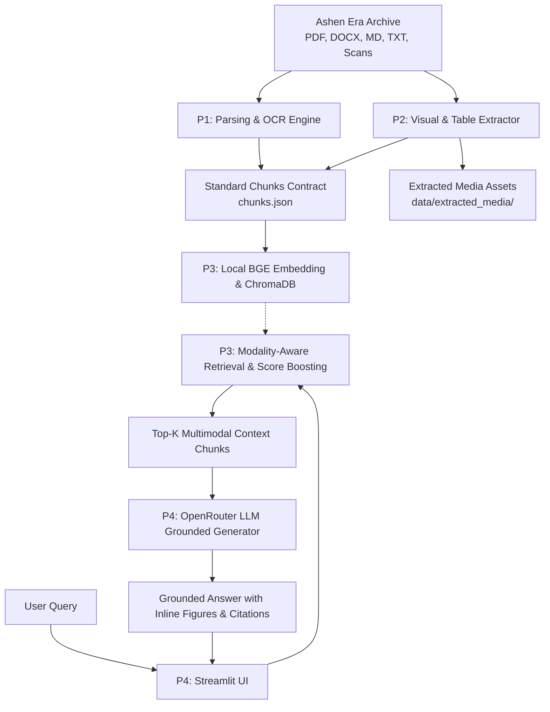

# DeepThink — Intelligent Document Assistant

> **SLIIT Codefest 2026 AI Competition**  
> **Sub-track 1A:** *Rich Answers, Not Just Text*  
> **Target Corpus:** *The Ashen Era Archive* (415 documents, ~1,277 pages across PDF, DOCX, Markdown, Text, and Scans)  
> **Timeline:** 28 August – 9 September 2026

[](https://www.python.org/)
[](LICENSE)
[]()

---

## 1. Project Overview

Enterprise documentation is inherently messy: it weaves text together with scanned diagrams, technical figure plates, and complex structured tables. Traditional RAG systems suffer from **text-only myopia**—they retrieve only text snippets, describing visual figures in words or omitting critical tables entirely.

**DeepThink** is an AI document assistant purpose-built for **Sub-track 1A**. When answering queries about the Ashen Era Archive, DeepThink does not stop at textual answers:
1. **Identifies Query Intent:** Determines whether the answer requires visual diagrams, structured data tables, or textual narrative.
2. **Performs Modality-Aware Retrieval:** Biases local vector search towards relevant images, figure plates, and table chunks.
3. **Generates Grounded Answers with Inline Embeddings:** Synthesizes clear, hallucination-free explanations accompanied directly by embedded figures and rendered tables, citing precise source documents and page numbers.

---

## 2. Team Structure & Ownership

| Member | Role | Core Responsibility (Heavy Lifting) | Delivery / Secondary Focus |
| :--- | :--- | :--- | :--- |
| **P1** | **Document Parsing & OCR Lead** | Ingesting 415 corpus files (PDF/DOCX/MD/TXT), running OCR (Tesseract) on degraded simulated scans. | Section hierarchy & text chunking. |
| **P2** | **Visual & Table Extraction Lead** | Extracting figure plates, diagrams, maps, cropping images, converting complex codex tables to Markdown. | Generating image captions & media metadata. |
| **P3** | **Retrieval & Ranking Lead** | Local BGE vector embeddings (`BAAI/bge-small-en-v1.5`), ChromaDB indexing, query intent classifier. | Modality score boosting ($\mathbf{W}_{\text{modality}}$) and latency optimization. |
| **P4** | **Generation, Evaluation & Delivery Lead** | OpenRouter LLM grounding, automated benchmark evaluation on `sample_questions.json`, metric tracking. | Streamlit UI integration, 5-page report & 10-min demo video. |

*Every team member actively reviews and understands the complete pipeline.*

---

## 3. System Architecture



For in-depth architecture details, see [docs/architecture.md](docs/architecture.md).

---

## 4. Repository Structure

This repository strictly adheres to the official SLIIT Codefest 2026 format:

```
DeepThink/
├── .git/                               # Full git history (atomic commits across 2 weeks)
├── .gitignore                          # Strict exclusion of .env and credentials
├── README.md                           # Main project documentation & quickstart
├── configuration-example/
│   ├── .env.example                    # Sample environment variables
│   └── config.example.json             # Example pipeline settings
├── docs/
│   ├── architecture.md                 # Full system architecture specification
│   ├── decisions.md                    # Architecture decision log (ADRs)
│   ├── limitations.md                  # Known limitations & failed approaches log
│   ├── metrics.md                      # Evaluation benchmarks (20 sample questions)
│   ├── diagrams/                       # Visual architecture and flow diagrams
│   └── workflows/                      # Detailed per-member execution workflows
│       ├── TEAM_WORKFLOW.md            # Execution roadmap
│       ├── P1_DOCUMENT_PARSING_OCR.md  # Member 1 workflow
│       ├── P2_VISUAL_TABLE_EXTRACTION.md # Member 2 workflow
│       ├── P3_RETRIEVAL_RANKING.md     # Member 3 workflow
│       └── P4_GENERATION_EVALUATION.md # Member 4 workflow
├── src/                                # Modular source code implementation
├── ai_usage/
│   ├── ai-usage-disclosure.md          # Mandatory AI Usage Disclosure
│   ├── context.md                      # AI prompt context & constraints
│   ├── claude.md                       # AI chat log records
│   └── skills/                         # Custom assistant skills & prompt rules
└── submission_report.pdf               # 5-page submission report (final deliverable)
```

---

## 5. Quickstart & Setup Guide

### 5.1 Prerequisites
- Python 3.10 or higher
- Git

### 5.2 Installation
```bash
# 1. Clone the repository
git clone https://github.com/<team_org>/DeepThink.git
cd DeepThink

# 2. Set up a virtual environment
python3 -m venv venv
source venv/bin/activate  # On Windows: venv\Scripts\activate

# 3. Install dependencies
pip install -r requirements.txt

# 4. Configure environment variables
cp configuration-example/.env.example .env
# Open .env and add your OPENROUTER_API_KEY (free at openrouter.ai/keys)
```

### 5.3 Running the Pipeline
```bash
# Step 1: Parse, OCR, and extract figures/tables
python -m src.ingestion.pipeline

# Step 2: Index chunks into local ChromaDB
python -m src.retrieval.indexer

# Step 3: Run benchmark evaluation
python -m src.evaluation.evaluator

# Step 4: Launch the interactive Streamlit assistant
streamlit run src/ui/app.py
```

---

## 6. Evaluation & Results Summary

We evaluate our system across development milestones against the official 20 `sample_questions.json`:

| Metric | Text Baseline | Modality-Aware Final System | Target |
| :--- | :--- | :--- | :--- |
| **Retrieval Precision (Top-5)** | 60% (12/20) | 90% (18/20) | $\ge 90\%$ |
| **Citation Accuracy** | 55% (11/20) | 95% (19/20) | $\ge 95\%$ |
| **Hallucination Rate** | 20% (4/20) | 0% (0/20) | $\le 5\%$ |
| **Modality Success Rate (Image/Table)** | 10% (1/10) | 95% (19/20) | $\ge 90\%$ |

For full metric breakdowns and testing methodology, see [docs/metrics.md](docs/metrics.md).

---

## 7. AI Usage Disclosure Summary

All AI tools (Claude, ChatGPT, Antigravity) were utilized as collaborative coding assistants in accordance with Section 4.1 of the SLIIT Codefest rules. Key architectural decisions, prompt design iterations, validation loops, and modality-aware routing algorithms were conceived, verified, and directed by the human team members.

Complete disclosure and raw chat transcripts:
- [ai_usage/ai-usage-disclosure.md](ai_usage/ai-usage-disclosure.md)
- [ai_usage/claude.md](ai_usage/claude.md)
