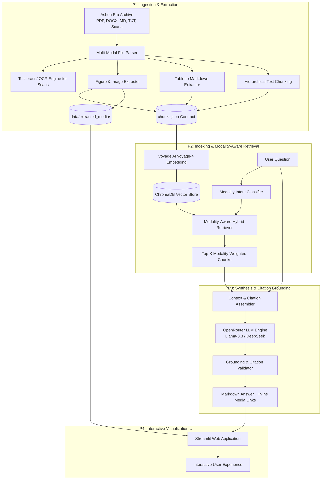

# DeepThink — System Architecture Specification

> **SLIIT Codefest 2026 AI Competition**  
> **Sub-track 1A:** *Rich Answers, Not Just Text*  
> **Target Corpus:** *The Ashen Era Archive* (415 docs, ~1,277 pages)

---

## 1. High-Level Architecture Overview

DeepThink is designed to bridge the gap between unstructured multi-format enterprise documents and end-user visual comprehension. Instead of collapsing all documents into flat text, DeepThink preserves layout, tables, diagrams, and figures as distinct first-class entities with bidirectional links to their narrative context.



---

## 2. Core Data Contract: `chunks.json`

The shared contract uniting Ingestion (P1), Retrieval (P2), Generation (P3), and UI (P4) is the standardized `chunks.json` schema.

```json
[
  {
    "chunk_id": "codex_v1_p42_tab01",
    "document_name": "Codex_Imperial_Vol_1.pdf",
    "document_type": "pdf",
    "page_number": 42,
    "section_title": "Artillery Calibers and Supply Logistics",
    "modality": "table", 
    "content": "| Caliber | Range (km) | Shell Type | Rate of Fire |\n|---|---|---|---|\n| 105mm | 15.2 | High Explosive | 6 rpm |\n| 155mm | 24.7 | Armor Piercing | 3 rpm |",
    "media_path": "data/extracted_media/tables/codex_v1_p42_tab01.png",
    "caption": "Imperial Artillery Specifications Table, Page 42",
    "metadata": {
      "word_count": 35,
      "source_reliability": "official_codex",
      "related_entities": ["Imperial Artillery", "105mm", "155mm"]
    }
  }
]
```

### Modality Definitions:
- `text`: Narrative paragraphs, wiki entries, dialogue, letters, transcripts.
- `table`: Structured data tables serialized as markdown text and optionally backed by an image render.
- `image-caption`: Visual plates, anatomical drawings, faction crests, map scans, and technical schematics, containing image caption text + OCR text + disk path to the image file.

---

## 3. Sub-track 1A: Modality-Aware Retrieval Strategy

Standard semantic search models match query terms against nearest text tokens. When a user asks:
> *"Show me the diagram of the Sky-Fortress engine layout and explain how the coolant valve works."*

A naive RAG pipeline retrieves paragraphs describing the Sky-Fortress, completely ignoring the schematic diagram on plate 14.

### DeepThink Modality-Aware Solution:
1. **Query Intent Detection:** A lightweight classifier / heuristic parses whether the question asks for visual figures (`"diagram"`, `"figure"`, `"plate"`, `"map"`, `"show"`, `"look like"`) or structured data (`"table"`, `"specifications"`, `"stats"`, `"cost"`, `"dimensions"`).
2. **Dynamic Modality Weighting:**
   $$\text{FinalScore}(c) = \text{CosineSimilarity}(q, c) \times \mathbf{W}_{\text{modality}}(q, c)$$
   Where $\mathbf{W}$ boosts image and table chunks when visual intent is detected.
3. **Parent Document Context Injection:** When a figure chunk is retrieved, the immediate surrounding text chunk (caption/explanation) is bundled with it.

---

## 4. Grounded Generation & Inline Visual Injection

The LLM is prompted with strict grounding rules:
- Every claim must cite `[Document Name, Page Number]`.
- When an image or table chunk is provided in context, the LLM must embed the media using markdown syntax:
  ```markdown
  
  ```
- If the archive contains conflicting accounts (e.g. Tavern Ballad vs Official Codex), the LLM explicitly mentions the discrepancy rather than hallucinating a resolution.

---

## 5. Directory Mapping & Modules

- `src/ingestion/`: P1 modules for PDF/DOCX parsing, OCR, and chunk generation.
- `src/retrieval/`: P2 modules for Voyage AI embeddings and ChromaDB retriever.
- `src/generation/`: P3 modules for OpenRouter LLM calling, prompt formatting, and retry logic.
- `src/ui/`: P4 modules for Streamlit chat interface and media rendering.
