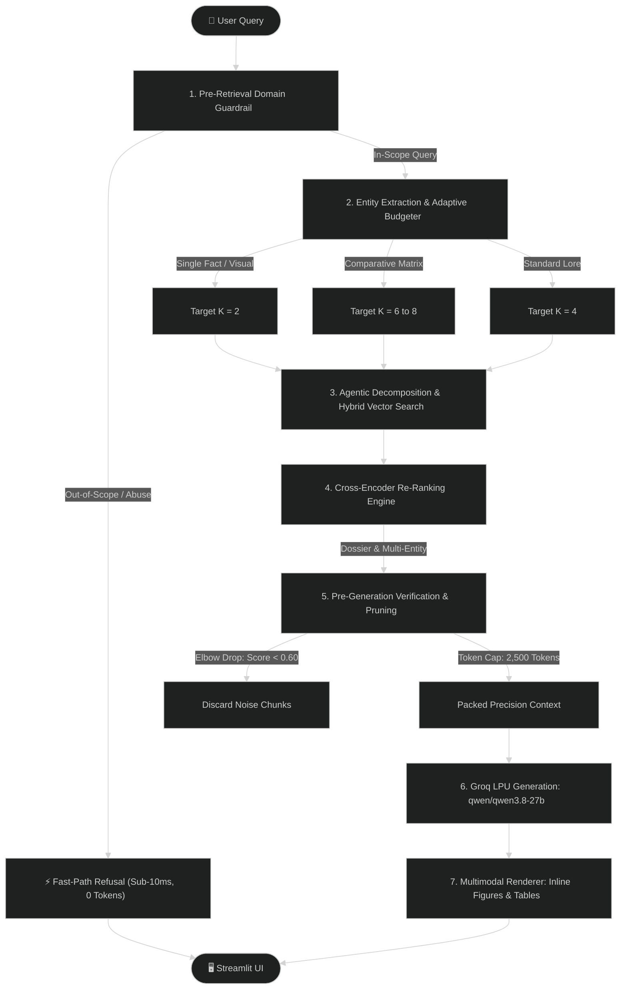

# DeepThink — System Architecture Specification

> **SLIIT Codefest 2026 AI Competition**
> **Sub-track 1A:** *Rich Answers, Not Just Text*
> **Target Corpus:** *The Ashen Era Archive* (415 docs, ~1,277 pages)
> **100% Free & Local-First Architecture**

---

## 1. High-Level Architecture Overview

DeepThink is engineered as an **Autonomous Multimodal Compound RAG 3.0 System**. Rather than relying on simple, naive vector search, it processes queries through an **8-stage intelligent pipeline** designed for sub-1.5s latency, zero hallucination, strict epistemic restraint, and rich multimodal answers.


<details>
<summary><b>Click to view interactive Mermaid Flowchart</b></summary>



</details>

---

## 2. The 8-Stage Execution Pipeline

### Stage 1: Pre-Retrieval Domain Boundary Guardrail (`src/retrieval/router.py`)
- **Fast-Path Categorization**: Inspects queries before touching vector stores.
- **Categorized Multi-Option Refusal**:
  1. *Real-World Knowledge / History / Tech* (e.g. Hitler, Napoleon, Python coding, math) $\rightarrow$ Polite refusal + 3 archival alternatives.
  2. *Inappropriate Language / Abuse / Slurs* (e.g. profanity, multilingual slurs) $\rightarrow$ Professional refusal + 3 archival research topics.
  3. *Physical Sensors / Real-World Premise* (e.g. "what am I holding", camera prompts) $\rightarrow$ Clarification of digital archive boundaries + 3 repository queries.
  4. *Greetings* $\rightarrow$ Interactive greeting menu.
- **Execution Speed**: Refuses in $< 0.005$s with 0 LLM tokens spent.

### Stage 2: Entity Extraction & Adaptive Context Budgeting (`src/retrieval/entity_matcher.py`, `src/retrieval/adaptive_budget.py`)
- **Entity & Field Extraction**: Extracts proper nouns (character names, fortresses, factions, artifacts) and maps questions to 16 canonical field families (`birth_year`, `service_location`, `role`, `faction`, `caliber`, `range`, `garrison`, `cost`, etc.).
- **Dynamic Context Sizing ($K$)**:
  - *Single Fact / Visual Blueprint*: Allocates $K=2$.
  - *Standard Lore Inquiry*: Allocates $K=4$.
  - *Comparative Matrix (2+ entities)*: Allocates $K=6\text{--}8$.

### Stage 3: Agentic Multi-Hop Query Decomposition (`src/retrieval/agentic.py`)
- **Relational Preservation**: Retains the full original query in `sub_queries[0]`.
- **Targeted Sub-Queries**: Decomposes complex relational questions across multiple entities and executes parallel vector searches against the local ChromaDB index.
- **Corroboration Boost**: Applies a $+25\%$ score multiplier to candidate chunks surfaced across multiple retrieval hops.

### Stage 4: Precision Cross-Encoder Re-Ranking (`src/retrieval/reranker.py`)
- Re-scores candidates using a composite scoring formula:
  $$\text{Score} = \Big( 0.25 \cdot S_{\text{base}} + 0.20 \cdot S_{\text{sim}} + 0.25 \cdot C_{\text{kw}} + B_{\text{entity}} + B_{\text{dossier}} + B_{\text{multi}} + B_{\text{field}} \Big) \times M_{\text{reliability}} \times P_{\text{distractor}}$$
  - **$B_{\text{dossier}} (+0.35)$**: Subject's dedicated biographical file bonus.
  - **$B_{\text{multi}} (+0.40)$**: Multi-entity intersection match.
  - **$B_{\text{entity}} (+0.50)$**: Exact entity name match.
  - **$M_{\text{reliability}}$**: $1.1\times$ for official codices, $0.85\times$ for unverified ephemera.
  - **$P_{\text{distractor}}$**: $0.2\times$ penalty for zero-entity matches.

### Stage 5: Pre-Generation Verification Gate & Relative Drop-Off (`src/retrieval/verifier.py`, `src/retrieval/adaptive_budget.py`)
- **Relative Score Elbow Cutoff**: Prunes trailing noise chunks if $\text{Score}_i < 0.60 \times \text{Score}_{\text{top}}$.
- **Epistemic Refusal**: If a queried entity is completely unrecorded in the archive, emits an honest epistemic refusal before generation rather than hallucinating.
- **Token Density Packing**: Enforces a 2,500-token prompt context ceiling.

### Stage 6: Grounded Generation on Groq LPU (`src/generation/generator.py`)
- **Flagship Inference**: Calls `qwen/qwen3.8-27b` on Groq LPUs at **300+ tokens/second** (~1.4s latency).
- **Strict Epistemic Restraint (Directive 5)**:
  - Reports conflicting archival accounts verbatim with page citations.
  - Strictly forbids inventing speculative reasons, narrative framing, or unproven motives.
  - Forbids geographic overstatements (e.g. assuming a faction fought everywhere a conflict took place).
- **Structured Output**: Generates an **Executive Summary**, **Detailed Archival Breakdown Table**, and **Exact Page Citations** `[Document, Page X]`.

### Stage 7: Multimodal Asset Resolution (`src/generation/generator.py`)
- Validates that image paths `data/extracted_media/figures/...` exist on disk.
- Embeds verified figures directly: ``.

### Stage 8: Streamlit Interactive UI (`src/ui/app.py`)
- Renders native high-res figure plates (`st.image`), formatted markdown tables, and live performance telemetry (`⚡ Latency: 1.4s • Chunks: 2 (Adaptive) • CRAG: CORRECT`).
- Suppresses chunk expander on out-of-scope refusals.

---

## 3. Data Contract: `chunks.json`

```json
[
  {
    "chunk_id": "codex_v1_p42_tab01",
    "document_name": "codex_vaeloria_ii_armory_of_relics_and_bestiary.pdf",
    "document_type": "pdf",
    "page_number": 11,
    "section_title": "Armory of Relics",
    "modality": "image-caption",
    "content": "The Gauntlet of Sorrowfell forged at Vharencrag Fortress...",
    "media_path": "data/extracted_media/figures/atmo_relic_gauntlet_of_sorrowfell.png",
    "caption": "Gauntlet of Sorrowfell Relic Plate",
    "metadata": {
      "word_count": 45,
      "source_reliability": "official_codex",
      "related_entities": ["Gauntlet of Sorrowfell", "Vharencrag Fortress", "Greyfell Citadel"]
    }
  }
]
```

---

## 4. Module Map

- `src/ingestion/`: Multi-format parsing (PDF, DOCX, MD, TXT), Tesseract OCR, figure extraction, table parsing.
- `src/retrieval/`: Router guardrail, entity matcher, adaptive budgeter, agentic decomposer, cross-encoder reranker, pre-generation verifier, table aggregator.
- `src/generation/`: Grounded prompt assembly, Groq LPU API caller, media path resolver, retry with backoff.
- `src/evaluation/`: Automated benchmark evaluator testing all 20 sample questions against 4 quantitative metrics.
- `src/ui/`: Streamlit web interface with autonomous telemetry and native media rendering.
