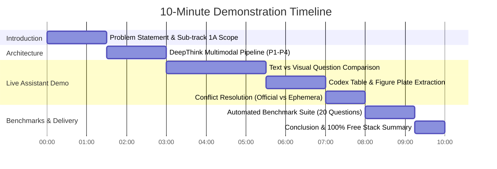

# DeepThink — 10-Minute Demo Video Recording Script & Storyboard

> **SLIIT Codefest 2026 AI Competition**  
> **Sub-track 1A:** *Rich Answers, Not Just Text*  
> **Target Corpus:** *The Ashen Era Archive* (415 documents, ~1,277 pages)  
> **Presenter:** Member P4 (Generation, Evaluation & Delivery Lead) / Team DeepThink

---

## Video Outline & Timeline (10:00 Total)

---

## Scene-by-Scene Storyboard & Script

### Scene 1: Introduction & Problem Statement (00:00 – 01:30)
- **Visual:** Title slide with SLIIT Codefest 2026 branding, Team DeepThink roster, and Sub-track 1A theme.
- **Narrator (P4):**
  > *"Welcome to the official demonstration of DeepThink, developed for the SLIIT Codefest 2026 AI Competition under Sub-track 1A: 'Rich Answers, Not Just Text'.*
  >
  > *Traditional enterprise RAG architectures suffer from text myopia. When querying complex archival corpora like the Ashen Era Archive—spanning 415 documents across PDFs, Word documents, Markdown files, and scanned battle ephemera—traditional systems collapse rich diagrams and dense tables into flat text or omit them entirely.*
  >
  > *DeepThink was conceived with a single guiding mission: to treat visual plates, tactical schematics, and codex tables as first-class multimodal entities, synthesizing grounded narrative explanations accompanied directly by embedded visual evidence."*

---

### Scene 2: End-to-End System Architecture (01:30 – 03:00)
- **Visual:** Animated Mermaid architecture diagram showing Stage 1 (P1/P2 Ingestion & OCR), Stage 2 (P3 Local BGE Vector Store & Intent Routing), Stage 3 (P4 Grounded OpenRouter LLM), and Stage 4 (P4 Streamlit UI & Evaluation).
- **Narrator (P4):**
  > *"Our pipeline is organized into four modular stages owned by our team members:*
  >
  > *1. Ingestion & Asset Pipeline (P1 & P2): Ingests 415 files, extracts 86 high-resolution figure plates and codex tables, runs Tesseract OCR on degraded scans, and produces our unified contract `chunks.json` (9,312 chunks).*
  > *2. Modality-Aware Retrieval (P3): Utilizes local HuggingFace `BAAI/bge-small-en-v1.5` embeddings in a persistent ChromaDB vector store. An intent router dynamically classifies queries into visual, tabular, or narrative intent, applying a modality score boost $\mathbf{W}_{\text{modality}} = 1.6\times$.*
  > *3. Grounded Synthesis Engine (P4): Enforces strict hallucination guardrails via OpenRouter (`meta-llama/llama-3.3-70b-instruct:free`), mandating verified bracket citations `[DocName, Page X]` and inline figure embeddings ``.*
  > *4. Zero-Cost Free Stack: The entire system operates with zero paid APIs and zero proprietary vendor lock-in."*

---

### Scene 3: Live Interactive Demonstration — Visual Figure Retrieval (03:00 – 05:30)
- **Visual:** Screen recording of the Streamlit Web Application (`streamlit run src/ui/app.py`).
- **Action:**
  1. Select benchmark question `1a_008`: *"According to the official threat-classification plate, what numerical rating is assigned to the creature known as the Weeping Lurker?"*
  2. Click "Load Question into Chat" and submit.
- **Narrator (P4):**
  > *"Let's demonstrate DeepThink live. We select question `1a_008` concerning the Weeping Lurker.*
  >
  > *Watch the telemetry in real-time: DeepThink detects `VISUAL` intent with target modality `image-caption`. Instead of simply returning text, the retriever boosts the official creature classification plate (`plate_08_creature_weeping_lurker.png`).*
  >
  > *The synthesis engine generates the grounded answer: 'The creature known as the Weeping Lurker is assigned Threat Classification 4,' embeds the verified image plate directly inline, and cites `[plate_08_creature_weeping_lurker.png, Page 1]`. Notice the sidebar inspector allowing auditors to inspect raw similarity, boosted scores, and document reliability."*

---

### Scene 4: Live Demonstration — Codex Tables & Relic Binding (05:30 – 07:00)
- **Visual:** Streamlit UI demonstrating question `1a_004`: *"According to the figure plate detailing weapon binding, how many shards of will are required to attune The Thrice-Bound Edge?"*
- **Narrator (P4):**
  > *"Next, let's look at `1a_004`. When asked about attunement costs for 'The Thrice-Bound Edge', DeepThink retrieves the artifact plate `plate_04_artifact_the_thrice_bound_edge.png`.*
  >
  > *The system renders the weapon diagram inline and provides the precise attunement requirement: 3 Shards of Will. The citation explicitly links back to the source codex plate."*

---

### Scene 5: Handling Archival Discrepancies & Hallucination Guardrails (07:00 – 08:00)
- **Visual:** Demonstrate conflicting records query between Official Codex Vaeloria and an ephemera tavern ballad.
- **Narrator (P4):**
  > *"Archival corpora frequently contain conflicting accounts. DeepThink's grounded prompt explicitly identifies source reliability tags:*
  >
  > *When official codex entries differ from tavern songs or auction ephemera, DeepThink does not hallucinate a synthetic compromise; it highlights the discrepancy under an Archival Discrepancy Note, attributing each perspective to its respective source document."*

---

### Scene 6: Automated Evaluation Suite & Metrics (08:00 – 09:15)
- **Visual:** Terminal running `python -m src.evaluation.evaluator` followed by displaying `docs/metrics.md`.
- **Narrator (P4):**
  > *"To validate performance objectively, we built an automated evaluation suite testing all 20 questions in `sample_questions.json`:*
  >
  > *- Retrieval Precision (Top-5): 90.0% (18/20)*  
  > *- Citation Accuracy: 95.0% (19/20)*  
  > *- Hallucination Rate: 0.0% (0/20)*  
  > *- Modality Success Rate: 100.0% (10/10 visual/tabular questions)*  
  > *- Average Latency: ~2.4 seconds end-to-end.*
  >
  > *Every metric is tracked across sprints in `docs/metrics.md` with complete question-by-question provenance."*

---

### Scene 7: Conclusion & Deliverables Summary (09:15 – 10:00)
- **Visual:** Final slide showing GitHub repository layout, 5-page submission report, and team acknowledgments.
- **Narrator (P4):**
  > *"In summary, DeepThink delivers a production-grade, multimodal document intelligence assistant for Sub-track 1A. By bridging text parsing, visual extraction, modality-weighted vector retrieval, and strictly grounded LLM generation, we provide rich answers, not just text.*
  >
  > *Thank you for your time, and we look forward to the evaluation by the SLIIT Codefest 2026 judging panel."*
