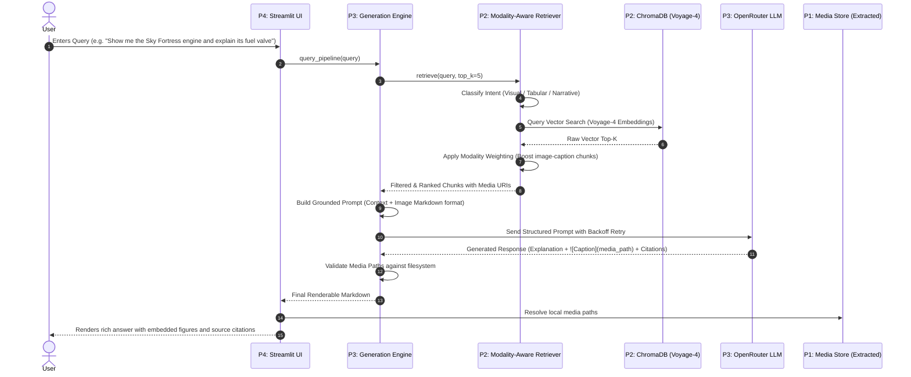
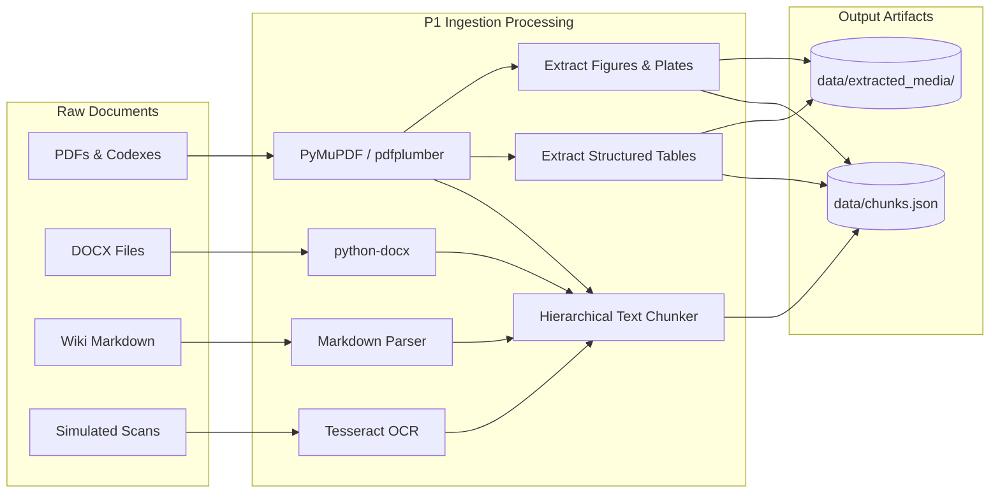
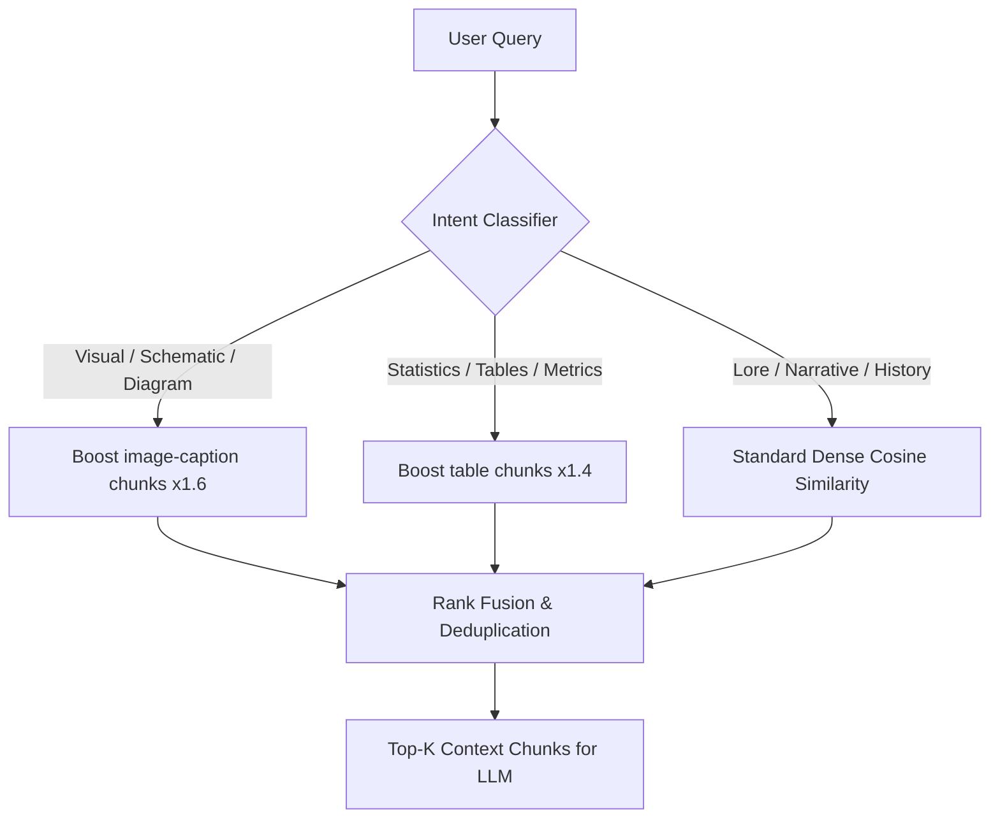

# DeepThink — Architecture & Flow Diagrams

This document contains visual diagrams for DeepThink's multimodal ingestion, retrieval, and generation architecture.

---

## 1. End-to-End System Sequence Diagram

---

## 2. Ingestion & Chunking Pipeline Diagram

---

## 3. Modality-Aware Intent Routing

