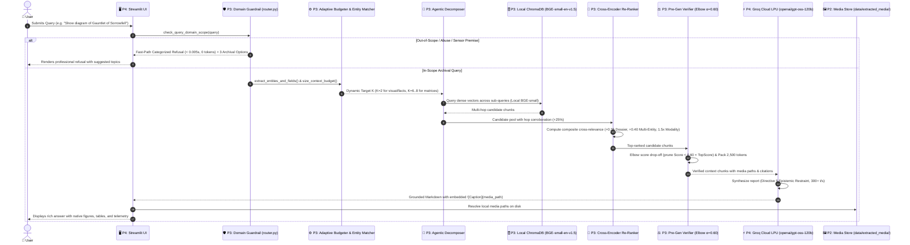
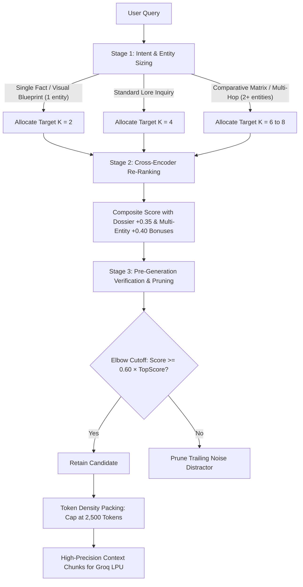

# DeepThink — Architecture & Flow Diagrams

This document contains visual diagrams for DeepThink's multimodal ingestion, compound retrieval, and grounded generation architecture for **Sub-track 1A: Rich Answers, Not Just Text**.

---

## 1. End-to-End System Sequence Diagram (Compound RAG 3.0)



---

## 2. Ingestion & Extraction Pipeline Diagram (P1 & P2)

```mermaid
graph LR
    subgraph Corpus [The Ashen Era Archive (415 docs, 1,277 pages)]
        PDF[PDF Chronicles & Codexes]
        DOCX[DOCX Letters & Transcripts]
        MD[Fan-Wiki Articles]
        SCANS[Simulated Scans & Ephemera]
        STANDALONE[Standalone Plate Images]
    end

    subgraph P1 Lead [P1 Lead: Text Parsing & OCR]
        PDF --> PyMuPDF_Text[PyMuPDF Text Extractor]
        DOCX --> DocxParser[python-docx Parser]
        MD --> MDParser[Markdown Header Splitter]
        SCANS --> Tesseract[Tesseract OCR Engine]

        PyMuPDF_Text --> TxtChunk[Hierarchical Text Chunker ~800 chars]
        DocxParser --> TxtChunk
        MDParser --> TxtChunk
        Tesseract --> TxtChunk
    end

    subgraph P2 Lead [P2 Lead: Visual & Table Extraction]
        PDF --> PyMuPDF_Img[PyMuPDF Image Extractor]
        PDF --> Plumber_Tab[pdfplumber Table Extractor]
        STANDALONE --> ImgIngest[Standalone Plate Ingestion]

        PyMuPDF_Img --> FiguresDir[(data/extracted_media/figures/)]
        STANDALONE --> FiguresDir
        Plumber_Tab --> TablesDir[(data/extracted_media/tables/)]

        PyMuPDF_Img --> VisualChunk[Image-Caption Chunks]
        STANDALONE --> VisualChunk
        Plumber_Tab --> TableChunk[Markdown Table Chunks]
    end

    subgraph Output Contract [data/chunks.json Contract (9,312 Chunks)]
        TxtChunk --> MasterJSON[(data/chunks.json)]
        VisualChunk --> MasterJSON
        TableChunk --> MasterJSON
    end
```

---

## 3. Dynamic 3-Stage Adaptive Context Budgeting (P3)



---

## 4. Team Ownership & Component Architecture

| Member | Role | Core System Component | Deliverables |
| :--- | :--- | :--- | :--- |
| **Fatheen M. F. A.** | **P1 Lead** | Multi-Format Document Parsing & OCR | `src/ingestion/parser.py`, `src/ingestion/ocr_engine.py`, text chunks in `chunks.json` |
| **M. M. M. Shakeer** | **P2 Lead** | Visual Media & Table Extraction | `src/ingestion/media_extractor.py`, `src/ingestion/table_extractor.py`, 86+ plates in `data/extracted_media/` |
| **Rasheed A. A. A.** | **P3 Lead (Team Lead)** | Retrieval, Compound RAG 3.0 & Ranking | `src/retrieval/` (indexer, retriever, router, budgeter, agentic, reranker, verifier) |
| **S. Dharshan** | **P4 Lead** | Grounded Generation, Evaluation & UI | `src/generation/generator.py`, `src/evaluation/evaluator.py`, `src/ui/app.py`, demo video & report |
