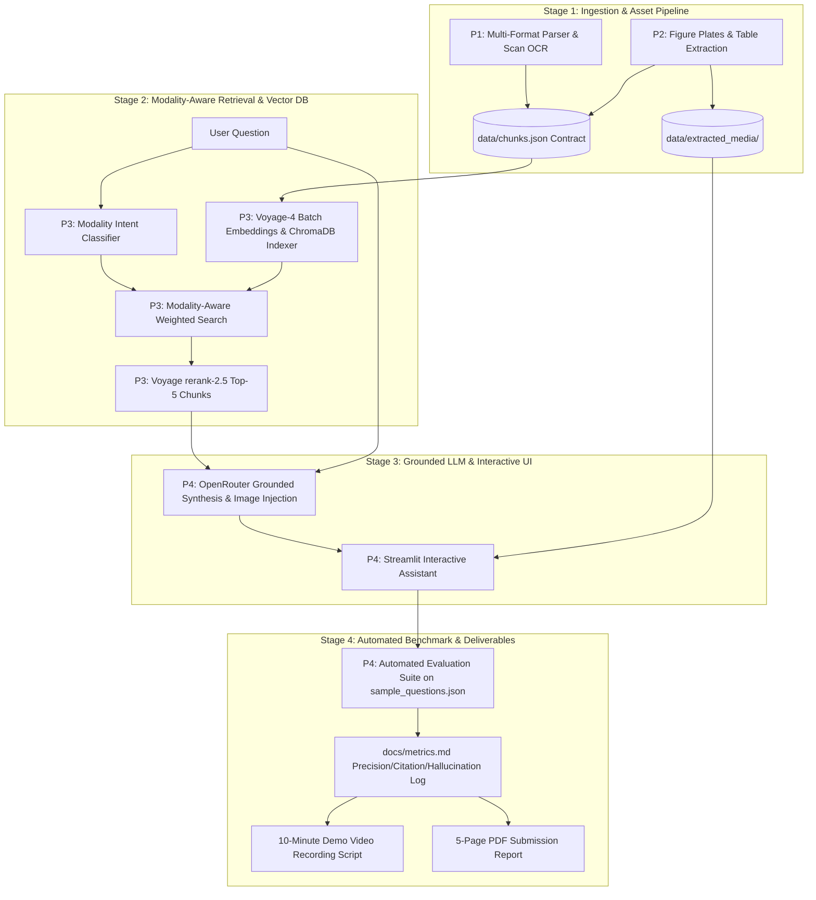

# Team Master Execution Plan — Complete System Build

> **SLIIT Codefest 2026 AI Competition**  
> **Sub-track 1A:** *Rich Answers, Not Just Text*  
> **Corpus:** *The Ashen Era Archive* (415 documents, ~1,277 pages)  
> **Target:** Complete End-to-End Build, Benchmark Evaluation & Deliverables Preparation

---

## 1. Roles & Ownership

| Member | Role | Core Responsibility (Heavy Lifting) | Delivery / Secondary Focus |
| :--- | :--- | :--- | :--- |
| **P1** | **Document Parsing & OCR Lead** | Ingesting 415 corpus files (PDF/DOCX/MD/TXT), running OCR (Tesseract) on degraded simulated scans, section hierarchy, and text chunking. | Metadata enrichment (`source_reliability`, `document_type`, `page_number`). |
| **P2** | **Visual & Table Extraction Lead** | Extracting figure plates, diagrams, maps, cropping images, converting complex codex tables to Markdown, linking media assets. | Maintaining `image-caption` & `table` entries in `chunks.json`. |
| **P3** | **Retrieval & Reranking Lead (Team Leader)** | Voyage AI embeddings (`voyage-4`), ChromaDB indexing, query intent classifier, modality score boosting, and Voyage `rerank-2.5` reranking. | Hybrid search (Dense + BM25) and retrieval latency optimization. |
| **P4** | **Generation, Evaluation & Delivery Lead** | OpenRouter LLM grounding, hallucination guardrails, automated benchmark evaluation on `sample_questions.json`. | Streamlit UI integration, 10-min demo video, and 5-page submission report. |

---

## 2. Complete Execution Assembly Line

---

## 3. Execution Checklist

- [x] **Setup & Scaffolding:** Repository layout, `.gitignore`, `.env.example`, `requirements.txt`, unit test suite (`6/6 OK`).
- [ ] **Stage 1 (Ingestion & Extraction):** Build `src/ingestion/parser.py`, `ocr_engine.py`, `media_extractor.py`, and `table_extractor.py`.
- [ ] **Stage 2 (Retrieval & Indexing):** Build `src/retrieval/indexer.py`, `router.py`, and `retriever.py` with Voyage AI embeddings and modality boosting.
- [ ] **Stage 3 (Generation & UI):** Build `src/generation/generator.py` and `src/ui/app.py` with citation enforcement and inline media rendering.
- [ ] **Stage 4 (Evaluation & Hardening):** Build `src/evaluation/evaluator.py`, execute the 20-question benchmark, and log verified metrics in `docs/metrics.md`.
- [ ] **Stage 5 (Deliverables):** Prepare 10-minute demo video script outline and 5-page submission report structure.
