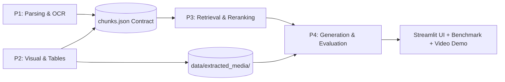

# Team Master Execution Plan & Workflow

> **SLIIT Codefest 2026 AI Competition**  
> **Sub-track 1A:** *Rich Answers, Not Just Text*  
> **Corpus:** *The Ashen Era Archive* (415 documents, ~1,277 pages)  
> **Competition Window:** 28 August – 9 September 2026 (11:30 PM Submission)

---

## 1. Roles & Ownership (Rebalanced for Maximum Technical Impact)

To maximize marks on **Technical Execution (25%)**, **Problem Understanding (15%)**, and **Engineering Best Practices (15%)**, the team structure focuses heavily on extraction quality, intelligent retrieval, and rigorous evaluation rather than superficial UI design.

| Member | Role | Core Responsibility (Heavy Lifting) | Secondary / Delivery Responsibility |
| :--- | :--- | :--- | :--- |
| **P1** | **Document Parsing & OCR Lead** | Ingesting 415 corpus files (PDF/DOCX/MD/TXT), running OCR (Tesseract) on degraded simulated scans, section hierarchy, and text chunking. | Metadata enrichment (`source_reliability`, `document_type`, `page_number`). |
| **P2** | **Visual & Table Extraction Lead** | Extracting figure plates, diagrams, maps, cropping images, converting complex codex tables to Markdown, linking media assets. | Maintaining `image-caption` & `table` entries in `chunks.json`. |
| **P3** | **Retrieval & Reranking Lead** | Voyage AI embeddings (`voyage-4`), ChromaDB indexing, query intent classifier, modality score boosting, and Voyage `rerank-2.5` reranking. | Hybrid search (Dense + BM25) and retrieval latency optimization. |
| **P4** | **Generation, Evaluation & Delivery Lead** | OpenRouter LLM grounding, hallucination guardrails, automated benchmark evaluation on `sample_questions.json`. | Streamlit UI integration (lightweight), 10-min demo video, and 5-page submission report. |

> [!IMPORTANT]
> **No Silos:** Each person is the **owner**, not the sole worker. All four members must review, test, and be capable of explaining/modifying every module on demand during the final on-site defense (Section 4.1 & 7).

---

## 2. Sprint-Based Schedule

### Sprint 0 — Alignment & Foundation (Day 1)
- **Goal:** Shared baseline, API setup, git discipline, and contract agreement.
- **Tasks:**
  - Read challenge document & explore the *Ashen Era Archive*.
  - Agree on `chunks.json` schema contract between all 4 roles.
  - Setup repository, `.gitignore`, `.env.example`, directory layout.
  - Every member signs up for Voyage AI (200M free tokens) & OpenRouter to multiply API quota.
- **Rubric Coverage:** Problem Understanding (15%), Engineering Best Practices (15%).

---

### Sprint 1 — Baseline System (Days 2–4)
- **Goal:** Working end-to-end text-only RAG bot by Day 4.
- **Tasks:**
  - **P1:** Parse text from PDF/DOCX/MD/TXT, generate baseline `chunks.json` (text-only).
  - **P2:** Set up image/table extraction scripts and define media folder structure.
  - **P3:** Set up Voyage AI, embed baseline chunks into ChromaDB, implement basic `retrieve(query, k)`.
  - **P4:** Set up OpenRouter client with backoff retry, build minimal Streamlit chat interface, and run baseline evaluation on the 20 sample questions.
  - **All:** Log baseline failure modes (especially image/table failures) into `docs/metrics.md`.
- **Milestone:** Functioning baseline text RAG pipeline.
- **Rubric Coverage:** Technical Execution (25%).

---

### Sprint 2 — Core Sub-track 1A Implementation (Days 5–9)
- **Goal:** Modality-aware retrieval and inline rich figure/table embedding.
- **Tasks:**
  - **P1:** Complete OCR processing for simulated scans and handwritten ephemera.
  - **P2:** Extract all figure plates and convert codex tables into clean Markdown tables; populate multimodal `chunks.json`.
  - **P3:** Re-embed with Voyage-4, implement query intent detection & modality-weighted scoring ($\mathbf{W}_{\text{modality}}$) + Voyage `rerank-2.5`.
  - **P4:** Implement grounded prompt synthesis with `` injection; wire inline media display in Streamlit UI.
  - **All:** Re-test all 20 sample questions, record before/after improvements in `docs/metrics.md`, export AI chat logs to `ai_usage/`.
- **Milestone:** Full multimodal RAG assistant answering with embedded figures and tables.
- **Rubric Coverage:** Technical Execution (25%), Impact & Relevance (10%), Human-AI Collaboration (15%).

---

### Sprint 3 — Hardening & Edge Cases (Days 10–11)
- **Goal:** Robustness, adversarial testing, hallucination elimination.
- **Tasks:**
  - **All:** Author 5+ adversarial/edge-case questions each (20+ new tests) covering contradictory lore, unmentioned items, scan noise.
  - **P1 & P2:** Patch OCR gaps, clean noisy text, and resolve merged table columns.
  - **P3:** Fine-tune modality boost weights and test hybrid BM25 + dense search.
  - **P4:** Run automated evaluation script, measure hallucination rate ($\le 5\%$), and document failure modes in `docs/limitations.md`.
  - **All:** Re-run full test benchmark, update metrics table.
- **Rubric Coverage:** Technical Execution (25%), Technical Judgment (10%).

---

### Sprint 4 — Packaging & Deliverables (Days 12–13)
- **Goal:** 10-minute demo video, 5-page submission report, repository audit.
- **Tasks:**
  - **P4:** Record demo video (3–4 min unedited live screen demo + architecture overview, $\le 10$ min total); upload unlisted to YouTube.
  - **P1, P2, P3:** Draft respective technical sections of the 5-page report with empirical graphs and tables.
  - **All:** Finalize the 5-page PDF report (`submission_report.pdf`).
  - **All:** Export complete AI chat logs to `ai_usage/`, finalize `ai_usage/ai-usage-disclosure.md` and `README.md`.
- **Rubric Coverage:** Presentation & Documentation (10%), Human-AI Collaboration (15%).

---

### Sprint 5 — Final Review & Submission (Day 14 - Buffer)
- **Goal:** Zero defect delivery before deadline (9 September, 11:30 PM).
- **Tasks:**
  - **All:** Verbal defense rehearsal — each member explains the entire pipeline out loud.
  - **P4 / Team:** Audit git history (`git log`) to verify no `.env` or API keys were committed.
  - **Team:** Verify unlisted YouTube video URL at top of submission report.
  - **Team:** Package ZIP archive and submit via official competition portal.

---

## 3. Non-Negotiables & Evaluation Alignment

1. **Atomic Commits from Day 1:** Commit small, frequent, and descriptive commits. No single monolithic end-of-project commit.
2. **Strict Secret Hygiene:** `.env` in `.gitignore` from commit #1. Never hardcode keys in code or chat.
3. **Continuous AI Log Export:** Export raw chat sessions as `.txt`/`.md` daily in `ai_usage/`.
4. **Honest Metrics:** Always report fractions alongside percentages (e.g. 18/20, 90%).
5. **Decision Logged on Day of Decision:** Every key architectural choice documented in `docs/decisions.md`.
